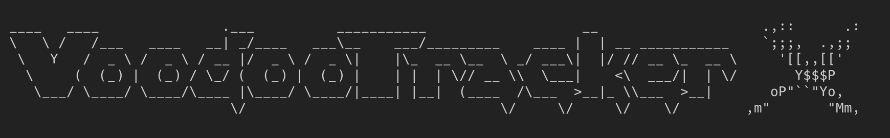

**Voodoo Tracker X: A modern resurrection of the classic 1990s FastTracker-style demo scene tracker.**

_VoodooTracker X_ is a modern macOS re-imagining of the classic scene trackers that inspired a generation of chip-tune and demo-scene musicians. Rebuilt from the ground up with modern tooling and macOS native UI in mind, the goal is to preserve the keyboard-first editing feel, pattern-based workflow, and compatibility with classic module formats — while giving the app a stable, testable, and extendable foundation for a future Pro release and iOS ports.

---

## Quick links
- **Repo:** `https://github.com/syncomm/voodootrackerx`
- **License:** MIT

---

## Goals & scope (first pass)
1. Provide playback and editing compatibility for classic module formats (MOD, XM).
2. Deliver a Mac-native UI that respects the original tracker workflows (keyboard navigation, pattern editing).
3. Ship small, verifiable PRs with automated checks and tests so the project can be iterated by agentic tools and humans alike.
4. Keep the core engine open-source while enabling a future commercial “Pro” edition with additional features.

---

## Getting started
```bash
# clone
git clone git@github.com:syncomm/voodootrackerx.git
cd voodootrackerx
open app/VoodooTrackerX/VoodooTrackerX.xcodeproj
```

## Build and test (CLI)
```bash
xcodebuild \
  -project app/VoodooTrackerX/VoodooTrackerX.xcodeproj \
  -scheme VoodooTrackerX \
  -configuration Debug \
  -destination 'platform=macOS' \
  -derivedDataPath build \
  CODE_SIGNING_ALLOWED=NO \
  build

xcodebuild \
  -project app/VoodooTrackerX/VoodooTrackerX.xcodeproj \
  -scheme VoodooTrackerX \
  -configuration Debug \
  -destination 'platform=macOS' \
  -derivedDataPath build \
  CODE_SIGNING_ALLOWED=NO \
  test
```

## Run the app (CLI verification)
```bash
xcodebuild \
  -project app/VoodooTrackerX/VoodooTrackerX.xcodeproj \
  -scheme VoodooTrackerX \
  -configuration Debug \
  -destination 'platform=macOS' \
  -derivedDataPath build \
  CODE_SIGNING_ALLOWED=NO \
  build

open build/Build/Products/Debug/VoodooTrackerX.app
```

Expected result: a single frontmost window titled `VoodooTracker X` opens at a visible default size (about `1000x700`) with a read-only module display.
For XM files, use `File > Open…` and you should see Pattern 0 in a monospaced tracker-style grid.
Navigation: `Up`/`Down` moves the highlighted row, `Page Up`/`Page Down` jumps by 16 rows, `Home`/`End` jumps to first/last row, and `Left`/`Right` changes the focused channel indicator.
Pattern dropdown defaults to used patterns from the song order; enable `Show all patterns` to include full pattern count.

To run the executable directly and see DEBUG startup logs:
```bash
build/Build/Products/Debug/VoodooTrackerX.app/Contents/MacOS/VoodooTrackerX
```

Expected DEBUG lines include `[VTX DEBUG] applicationDidFinishLaunching entered` and window creation/show details.

## Core Parser Smoke Tests
```bash
swift test --filter ModuleCoreTests

swift run mc_dump tests/fixtures/minimal.mod
swift run mc_dump tests/fixtures/minimal.xm
swift run mc_dump --json tests/fixtures/minimal.xm
swift run mc_dump --json --include-patterns tests/fixtures/minimal.xm
swift run mc_dump --json --pattern 1 tests/fixtures/minimal.xm

./scripts/run-golden.sh
```

The core parser smoke harness is read-only for now (header metadata plus XM pattern event decode; no playback or DSP).
See `docs/testing.md` for fixture rules and golden snapshot workflow.

## Project structure
* /app/ — Xcode project & macOS app code (AppKit/Swift)
* /core/ — playback engine, DSP (C/C++ or Swift)
* /tests/ — unit & golden tests
* /docs/ — design notes, format notes, contributor guide
* /assets/ — sample modules, themes
* /tools/ — scripts, build helpers

## Contributing
We welcome help. Please read `AGENTS.md` for the project’s required automation & contribution rules — it also describes the expectations for agentic contributors.

High-level rules:

* Small PRs (target ≤ 500 lines) that implement a single goal.
* All code changes must include tests (unit, integration or golden).
* Follow the coding conventions in AGENTS.md.
* When in doubt, open an issue and reference the related milestone.

## Roadmap (first milestones)
Current baseline delivered:
1. macOS CI + local CLI build/test workflow
2. AppKit app shell with reliable launch window, `File > Open…`, and standard window actions
3. Core MOD/XM header parser with synthetic fixtures, golden snapshots, and `mc_dump`

For detailed, PR-by-PR milestones, see `docs/roadmap.md`.

## License
MIT — see `LICENSE` for details.

## Contact / provenance
Originally authored in the late 1990s. The modern resurrection is led by Gregory S. Hayes (syncomm), preserving the spirit of the demo scene while building for modern machines and future platforms.
