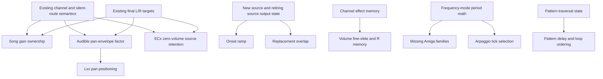

# FT2/XM closure matrix

## Supported target and authority

The milestone asks: **what would still make a supported XM sound or behave
observably differently in FT2?** The milestone is **open**. This evidence-only
matrix changes no playback behavior, admission rule, file format, or ADR.
Evidence baseline: synchronized main `7ec40947af0e15a22a8ec7227ac88c535714bef6`,
audited 2026-10-01 with fresh reports, not prior closure-branch artifacts.

The target is loaded original FT2/XM with exact instrument/keymap/sample identity,
including declared empty routes, Linear mode and the loaded Amiga paths below.
Editable documents retain their existing Linear subset. Original FT2 commands
listed as gaps require implementation or an accepted, scoped deferral before
closure; today's `Deferred` support label alone is insufficient. MOD reading,
read-only loaded-source ownership, and [ADR 014](decisions/014-loaded-xm-editable-copy-planning.md)
remain protected. OpenMPT extensions, native editable Amiga creation and callback
RT-safety work are separate contracts.

Production code and tests define current behavior; [effect support](xm-effect-support.md)
defines command-family support and [the roadmap](roadmap.md) defines sequencing.
ADR 014 owns editable-copy admission. Reference
observations use pinned ft2-clone
[`87be42543dac82cf802b5bddad917bda62ace131` replayer](https://github.com/8bitbubsy/ft2-clone/blob/87be42543dac82cf802b5bddad917bda62ace131/src/ft2_replayer.c)
and [audio host/mixer integration](https://github.com/8bitbubsy/ft2-clone/blob/87be42543dac82cf802b5bddad917bda62ace131/src/ft2_audio.c).
An external observer executes its unchanged loader, tick dispatch and mixer,
with stereo Float32, Linear interpolation, volume ramping on, amplification 10,
master volume 256 and Precise BPM off. VTX comparisons use the matching FT2
profile, gain 1 and integral 125-BPM tick lengths at 48/44.1 kHz. This is a pinned
reference experiment, not a claim about every clone configuration.

Each row has one primary class. `CLOSED` applies only to its stated bounded
contract; `PARITY-WATCH` means implemented with unclosed interactions. Confirmed
gaps distinguish parent, memory, timing, audible foundation and Amiga math.
`KNOWN-REFERENCE-DIFFERENCE` is an open compatibility obligation unless explicitly
excluded or justified; `NEEDS-CHARACTERIZATION` makes no invented parity claim.
The support reference separates support, FT2 closure, memory and pitch-mode
coverage. This matrix's `MISSING-PARENT`, `MISSING-MEMORY`, `MISSING-TIMING`,
`MISSING-AMIGA-MODE-PATH`, audible-foundation and retained-difference classes
explain why closure remains open; `NOT-V1` applies to an actual target exclusion.
An FT2-inert byte can be closed while an audible extension for that byte is NOT-V1.

## Closed foundations

| Bounded behavior | Class | Current evidence and boundary |
| --- | --- | --- |
| G01 sample-header/channel-volume ownership | CLOSED | [XMVolumeOwnershipTests](../tests/vtx_render_bounded_xm/XMVolumeOwnershipTests.swift), note-only and runtime cursor controls: header 0/16/64 initializes/restores defaults; song output consumes them once. Exact mapped zero-header PCM stays active while silent and later Cxx reveals its continuing cursor; empty/unrepresented routes stay source-less and preview policy is unchanged. Both-rate constant-source controls match settled FT2 levels within `6e-8`, with exact VTX runtime/whole/window agreement. |
| G06 audible pan-envelope factor | CLOSED | [XMPanningEnvelopeTests](../tests/vtx_render_bounded_xm/XMPanningEnvelopeTests.swift), shared runtime controls: observed byte-domain displacement joins the existing final-L/R target at 44.1/48 kHz. Neutral audio, static baseline, silent routes, sustain/loop/logical release, resets and carry are covered. This closes the output factor only; retained pan-clock/Q8/point-64 differences and G40 remain open. See [the owned contract](design/xm-reset-output-ramp.md#g06-panning-envelope-factor). |
| G07 Lxx panning-envelope positioning | CLOSED | [XMPanningEnvelopeTests](../tests/vtx_render_bounded_xm/XMPanningEnvelopeTests.swift), shared runtime-core controls: the sounding instrument's raw volume-sustain bit gates positioning, independent of volume enable/loop flags. Public gate/position/end/loop/release/reset/silent-route controls match pinned command-frame state at 44.1/48 kHz; whole/window/runtime-core tests preserve volume Lxx, G06 and exact routes. Maintainer-reported external full canonical Xcode testing and listening passed. This closes positioning only; G31 fractional/Q8 arithmetic, G40 static/header/8xx final pan law and the pan-sustain/release difference remain open. See [the owned contract and external verification](design/xm-reset-output-ramp.md#g07-lxx-panning-envelope-positioning). |
| Nonzero Fxx speed/BPM from command-row tick 0, including channel precedence | CLOSED | `fxx-timing.xm`, timing tests and shared frame plan; F00 is excluded below. Do not reopen the completed timing correction. |
| Linear regular/fine/tone units, extra-fine units and volume-column Fx/F0 | CLOSED | [PortamentoScalingTests](../tests/vtx_render_bounded_xm/PortamentoScalingTests.swift), both scaling fixtures: regular/fine/tone use `4 * parameter`, extra-fine uses `parameter`, Fx uses `64 * nibble`. This does not close missing fine-slide memory. |
| Amiga note lookup/finetune, 2xx and effect-column 3xx/300 scaling | CLOSED | Quantized lookup and VTX's 4x FT2-period representation; fresh reference control matches all 9 tone and 10 down-slide updates after conversion. Do not reduce correct `16 * parameter` deltas or promote neighboring families. |
| Integer 4xy/E4x and 7xy/E7x modulation, nibble memory and controls; 6xy/600 shared nonzero-tick slide | CLOSED | [VibratoFoundationTests](../tests/vtx_render_bounded_xm/VibratoFoundationTests.swift), [AmigaVibratoTests](../tests/vtx_render_bounded_xm/AmigaVibratoTests.swift), [XMVolumeOwnershipTests](../tests/vtx_render_bounded_xm/XMVolumeOwnershipTests.swift); 185 observed tremolo output updates match FT2. Amiga unsigned wrap and zero-step hold/resume are covered. Full audible families retain G39 parity-watch. |
| Channel-owned envelope/release clocks, integer fadeout, silent declared routes and non-retrigger reset | CLOSED | [XMEnvelopeSemanticTests](../tests/vtx_render_bounded_xm/XMEnvelopeSemanticTests.swift), [XMResetOutputTests](../tests/vtx_render_bounded_xm/XMResetOutputTests.swift); volume sustain/loop/release, Kxx and Lxx volume positioning are bounded contracts. Fractional interpolation, pan-clock quirks and unusual precedence remain open. |
| One final-L/R authority for managed voices: ordinary tick targets, quick volume/reset targets, deduplication and window carry | CLOSED | [XMAudibleOutputTests](../tests/vtx_render_bounded_xm/XMAudibleOutputTests.swift), reset tests; ordinary targets rebase from prior target, quick resets from current audible output. Managed voices avoid a second generic ramp. New-source onset and ECx are not covered by this closure. |
| Explicit mapped triggers/default caches, instrument-only reset, ordinary note-only routing and carried state | CLOSED | [NoteOnlyRoutingTests](../tests/vtx_render_bounded_xm/NoteOnlyRoutingTests.swift), volume-ownership/default-volume tests and public empty-slot/routing fixtures; no first-playable fallback, fabricated voice or source ownership. G01 concerns audible gain construction, not default-cache removal. |
| Seeded A00/500 memory and nonzero Axy/5xy slide scheduling; fine volume-column 8x/9x tick 0 | CLOSED | Existing adapter tests and fresh volume-column control. Zero fine-slide amount still restores output from base. Cold A00/500 is separately bounded below; 6xy timing is already corrected. |
| G08 ordinary volume-column 6x/7x timing | CLOSED | [VolumeColumnSlideTimingTests](../tests/vtx_render_bounded_xm/VolumeColumnSlideTimingTests.swift), public `volume-column-slide-timing.xm` and runtime tests: speeds 1/3/6, clamps, zero amounts, same-row Fxx/Cxx, trigger/continuation, silent/completed carry and envelope output. All 1,604 observed tick outputs match pinned FT2 at 44.1/48 kHz; whole/window/runtime plans agree with zero applied-frame delta. Canonical full Xcode testing and maintainer listening passed. Fine 8x/9x and A/5/6 memory remain independent; G31/G40 stay open. |
| G09 volume-column Dx/Ex timing and D0/E0 | CLOSED | [VolumeColumnPanSlideTimingTests](../tests/vtx_render_bounded_xm/VolumeColumnPanSlideTimingTests.swift), public `volume-column-pan-slide-timing.xm` and runtime controls: nonzero ticks at speeds 1/3/6, clamps, D0 forcing zero/E0 preserving pan, Fxx, header/Cx/8xx precedence, silent/completed carry and G06/G07. At both rates, 2,608 initialized-state reference ticks match exactly; Cx was retained at G09 closure and is corrected separately by G11 below; the cold 127.5-versus-128 baseline remains. Whole/window/runtime-core targets agree; canonical host applies all 135 events per rate with zero delta and PCM within PCM16 tolerance. Full Xcode passes; G08 PCM and static header/Cx/8xx baseline WAVs were identical for the G09 change. G33/G40 and onset/generic ramps stay open. |
| G11 volume-column Cx stored-pan mapping | CLOSED | [VolumeColumnPanningMappingTests](../tests/vtx_render_bounded_xm/VolumeColumnPanningMappingTests.swift) and shared runtime controls: all 16 column bytes match pinned FT2 at 44.1/48 kHz, from C0 = 0 through CF = 240 with C8 = 128; 750 observed stored-pan ticks agree per rate. Header/Cx/8xx precedence, silent/completed note-only carry, G09 and G06/G07 are covered. Whole/window/runtime targets use the corrected base under the unchanged G40 conversion/profile law. Canonical host applies all 261 events per rate with zero delta and PCM within PCM16 tolerance; full Xcode passes. Preview and exact header/8xx bytes remain unchanged. G33/G40, envelope arithmetic and cold initialization remain separate. |
| Valid same-cell ED0/nonzero EDx note dispatch; nonzero E9x interval triggers; ordinary Kxx release | CLOSED | Existing delay/retrigger/semantic tests; delayed instrument-only, E90, Rxy state and K00 precedence are distinct gaps. An internal hard stop remains immediate and is not ECx. |
| Shared runtime/offline event frames and window progress in tested profiles/rates | CLOSED | Fresh canonical-host checks for tremolo and Amiga 3xx: 509 and 24 C event applications respectively have zero scheduled/applied-frame delta. Matched VTX-profile captures agree within PCM16 quantization; six whole/window comparisons at 44.1/48 kHz have maximum error below `1.5e-8`. This is bounded delivery evidence, not universal audio or RT-safety closure. |

## Remaining gap matrix

Prevalence keys refer to the ledger below, including its zero and unavailable
values. Severity describes the consequence when hit, not a numeric ranking.
Dependencies name existing prerequisites separately from the primary class:
**S** channel/silent semantics; **O** shared final-L/R targets; **N** new-source /
retiring-source output state; **P** audible pan-envelope factor; **M** effect
memory; **F** frequency-mode math; **T** traversal state; **none** no missing
prerequisite. `N` is missing; P/S/O and the supported portions of F/T/M exist.

G06's output-factor closure preserves existing semantic clocks and Float segment
arithmetic. Focused controls confirm retained differences in release from pan
sustain, fractional Q8 values and slopes through stored point 64 versus the
reference loader's 63 limit. These remain open Phase 2 compatibility obligations;
the audible-factor closure does not resolve or justify them.

| ID / behavior | Primary class | Observable impact / severity when hit | Evidence / prevalence | Dependencies |
| --- | --- | --- | --- | --- |
| G02 new-note onset | MISSING-AUDIBLE-FOUNDATION | Abrupt first sample instead of a 5 ms transition; potentially conspicuous transient. | N; FT2 240 frames at 48 kHz / 220 at 44.1 kHz, VTX immediate. | N; existing O conventions |
| G03 same-channel replacement | MISSING-AUDIBLE-FOUNDATION | Different old/new-source overlap; transient level/discontinuity error. | R; FT2 ramps both over 5 ms; VTX starts new source immediately and retires old over 32 frames. Constant-source first replacement sample 0.0820009 vs 0.0276214; settled output agrees. | N, S |
| G04 ECx audible cut | MISSING-AUDIBLE-FOUNDATION | High impact for cut/recovery: hard retirement loses source/cursor that FT2 retains at zero volume. | Z / cut controls; EC0 and EC3 FT2 quick-volume transition is 5 ms. Internal stopVoice produces immediate silence and stays a separate contract. | S, O; source lifetime policy |
| G05 generic gain/pan ramp policy | KNOWN-REFERENCE-DIFFERENCE | Short update transients differ for voices outside managed final-L/R state; duration changes with sample rate. | N/PA/8; VTX generic 32-frame ramp vs reference tick/quick durations. Exact generic-only population is unavailable. | O; characterize plain-voice admission |
| G10 volume-column Ax/Bx | MISSING-PARENT | Missing pitch modulation despite recognized bytes. | Z; A4/B8 control; existing 4xy phase/memory is reusable. | S, M, F |
| G12 Hxy parent scheduling | MISSING-TIMING | Global mix trajectory changes once at row start instead of each nonzero tick. | Z; H01/H12 control; multi-channel fanout/order needs focused characterization. | S, O; tick plan exists |
| G13 H00 / H zero-parameter memory | MISSING-MEMORY | Later rows lose global slide continuation. | Z; H01 then H00 control; FT2 channel memory, VTX H00 no-op. | M, S; G12 timing |
| G14 cold A00 output restoration | MISSING-MEMORY | Held tremolo output survives when FT2's valid initial zero slide restores base on nonzero ticks. | A; unseeded A00 after 748 holds VTX output 63 vs FT2 base/output 32. Seeded memory remains supported. | M, S, O |
| G15 cold 500 / target-volume interactions | NEEDS-CHARACTERIZATION | Potential same zero-memory restoration gap; tone target and speed must remain independent. | 5; code has missing-memory/no-target gates; fresh pack has two no-target outcomes, not a complete cold-target oracle. | M, S, F |
| G16 EA0/EB0 | MISSING-MEMORY | Missing tick-zero fine-volume continuation; repeated-row level error. | Z; EA1 then EA0 yields FT2 33,34 vs VTX 33,33; EB counterpart also probed. FT2 up/down memories are independent, separate from A/5/6. Nonzero parent timing is correct. | M, S, O |
| G17 E10/E20 | MISSING-MEMORY | Missing tick-zero fine pitch continuation. | Z (nonzero parent FP); E11/E10 and E21/E20 control. FT2 has independent directional fine-pitch memories; Amiga parent coverage is separately G29. | M, F |
| G18 X10/X20 | MISSING-MEMORY | Missing extra-fine pitch continuation. | Z (nonzero parent XP); X11/X10 and X21/X20 control. FT2 has independent directional extra-fine memories, separate from E1/E2; Amiga parents remain G29. | M, F |
| G19 E90 | MISSING-TIMING | Missing tick-zero source retrigger. This is not interval-memory replay. | Z; E93 then E90 control. Legacy `ignored_e90_no_effect_memory` reason does not define reference semantics. | S; trigger dispatch |
| G20 R00 and independent speed/mode nibble memory | MISSING-MEMORY | Repeat and volume modes are lost across rows/zero nibbles. | Z; R93/R00/R03/R90 control. | M, S; G21 counter |
| G21 Rxy counter, tick-zero dispatch and semantic carry | MISSING-TIMING | Repeat times and envelope state differ: VTX restarts row-local scheduling and fresh-trigger resets. | Z; R93 reference repeats at row ticks 2,5 vs VTX tick 3; envelope control distinguishes sample restart from instrument reset. | S, M; existing trigger/source path |
| G22 Rxy integer volume modes | KNOWN-REFERENCE-DIFFERENCE | Repeated small level errors can accumulate. Common-XM ratios do not establish FT2 arithmetic. | Z; mode 6 maps 32 to FT2 22 vs VTX 21. Verify other modes, rounding and clamps before closure. | S; none missing |
| G23 delayed instrument-only ED1...EDF | MISSING-PARENT | Missing delayed cached-default restore/reset/retrigger interaction on an active channel. | Z; ED1 instrument-only reference control restores header 64; VTX diagnoses `no_note_deferred`. | S, O; delayed dispatch exists |
| G24 K00 / note 97 / instrument / volume precedence | NEEDS-CHARACTERIZATION | Boundary cells can release or restore different volume/state; high if precedence is wrong. | K; ordinary and instrument-only K00 are tested; note+instrument/default ordering needs a pinned combination grid. | S, O; none missing |
| G25 Linear 0xy tick ordering | MISSING-TIMING | Wrong arpeggio pitch on intermediate ticks. | Z; speed-6 037 tick 1 is FT2 +7 semitones vs VTX +3, tick 2 reverses. FT2 remaining-tick order is speed-dependent; 000 is inert. | F; tick plan exists |
| G26 Amiga 0xy | MISSING-AMIGA-MODE-PATH | Missing arpeggio pitches. | Z; Amiga pitch control; implement quantized note selection plus G25 ordering. | F; G25 |
| G27 Amiga 1xx | MISSING-AMIGA-MODE-PATH | Missing upward slide. Supported Amiga 2xx scaling is unchanged. | Z (Linear parent UP); Amiga 104 control. | F, M |
| G28 Amiga 5xy and volume-column Fx | MISSING-AMIGA-MODE-PATH | Missing combined/tone target progression; diagnostic fix correctly preserves deferral. | Z in Amiga (Linear parents 5/VF); paired mode control. Amiga 6xy is already supported, not part of this gap. | F, M, S |
| G29 Amiga E1x/E2x, X1x/X2x and same-cell E5x | MISSING-AMIGA-MODE-PATH | Missing fine/extra-fine and finetune-trigger pitch changes. | Z in Amiga (Linear parents FP/XP); paired control. A no-note E5x is inert in the reference control, not a missing memory parent. | F, M; explicit trigger defaults |
| G30 pitch conversion / nongrid finetune / extremes | KNOWN-REFERENCE-DIFFERENCE | Small sustained pitch/phase drift; extreme clamps can be larger. | Z nongrid; finetune +1 gives VTX C-4 period 4607.5 vs FT2 4608. Fixed-point reference steps vs analytic VTX and Amiga base-range clamps remain. | F; none missing |
| G31 fractional volume-envelope arithmetic | KNOWN-REFERENCE-DIFFERENCE | Fractional target levels differ despite correct semantic ticks/fadeout. Audibility is unproven. | VE; retained floating interpolation vs FT2 integer/Q8 arithmetic in current design/tests. | S, O; none missing |
| G32 instrument autovibrato | MISSING-PARENT | Missing automatic pitch motion from preserved instrument metadata. | AV; enabled public instrument plus dedicated control; runtime currently ignores it. | S, F; new instrument modulation state |
| G33 Pxy | MISSING-PARENT | Missing tick-level stereo movement. | Z; P01 control; legacy handler is not default C-adapter support. Pinned source confirms own whole-byte P00 replay; timing/mixed-nibble/pan-envelope interactions still need a focused oracle. | S, O, M |
| G34 Txy | MISSING-PARENT | Missing alternating audible/silent intervals. | Z; T11 control; pinned source confirms own whole-byte T00 replay. Counter/phase, cold state, trigger carry and channel-volume writer precedence still need characterization. | S, O, M |
| G35 EEx | MISSING-TIMING | High structural impact: row duration and every following event can diverge. | Z; EE1 control; recognized hazard currently has no traversal implementation. | T; tick replay rules |
| G36 E3x glissando | MISSING-PARENT | Tone-portamento output lacks reference quantization. | Z; E31 control plus pinned handler; audible target grid still needs a focused oracle. | F, M; tone target exists |
| G37 E6x implicit initial loop start | MISSING-TIMING | High structural impact: omitted repetition changes following song timing. | Z; E61 without E60 yields FT2 rows 0,1,2,0,1,2,3 vs VTX 0,1,2,3 / missing-loop-start diagnostic. | T |
| G38 Bxx/Dxx/E6x precedence and traversal boundaries | NEEDS-CHARACTERIZATION | Possible wrong order/row under conflicting channels, nested/repeated loops, restart or bounds. | Z; explicit-start traversal tests exist, default-start counterexample is G37; broader reference grid absent. | T; G35/G37 where combined |
| G39 full 4xy/6xy/7xy audible interactions and range boundaries | PARITY-WATCH | Supported integer modulation remains subject to output scaling/ramp and trigger/cut/edge behavior. | V/6/TR; no missing tremolo parent and no renewed 6xy timing gap. | S, O, F; G01–G05/G30 as applicable |
| G40 static 8xx / header pan law | KNOWN-REFERENCE-DIFFERENCE | Noncenter stereo amplitudes differ under current profile laws; exact panning state is already supported. | 8/PA; retained profile-law boundary; compare endpoints/interior and PE factor together before closure. | O; none missing |
| G41 9xx/900 and sample loop/end boundaries | PARITY-WATCH | Valid offsets, memory and loops are supported; boundary source retirement/interpolation can affect attacks and tails. | Z command occurrences; existing synthetic offset/loop tests. No fresh exhaustive FT2 boundary oracle. | S; N when replacement overlaps |

### Decision inputs for remaining candidates

Impact/severity and prevalence are in the preceding matrix/ledger. The table
below supplies dependency leverage, isolation, reference confidence, testability
and architectural risk for every candidate, without invented scores. **High**
confidence means current tests/source plus a fresh distinguishing control;
**bounded** means a parent/known boundary is established but interactions are not.
Temporary controls are evidence, not newly committed regression tests.

| IDs | Dependency leverage / implementation isolation | Reference confidence / focused test | Architectural risk |
| --- | --- | --- | --- |
| G02 | Reusable new-source start; C voice initialization plus window carry. | High for onset; constant source at both rates and truncated windows. | Medium: adds per-voice transition state; source identity and first sample matter. |
| G03 | Shares N with onset; retirement/source overlap is a separate contract. | High; two constant sources, consecutive replacement and window split. | Medium: bounded retiring voices and overlap limits. |
| G04 | Reuses O; adapter must keep source/cursor and lower base/output instead of retiring it. | High for ordinary cuts; EC0/EC3 plus later volume restoration, speed 1 and hard stop. | Medium semantic-lifetime risk, little new callback state. |
| G05 | Reuses O policies; isolate plain-voice admission before changing generic C controls. | Bounded; plain vs managed updates at two rates, quick/ordinary changes. | Medium: generic mixer clients and double-ramp regression. |
| G10 | Reuses 4xy phase/memory/period engine; volume-column dispatch. | High for absent parent; mixed effect/volume columns, zero nibbles and speed 1. | Low/medium: precedence between two writers. |
| G12 | Existing tick/global-volume path; fanout ordering remains scoped. | High for schedule, bounded multi-channel; nonzero ticks, two writers and envelopes. | Medium: global update must reach every sounding channel once. |
| G13 | Channel memory atop G12; no new C state. | High; Hxy→H00, zero initialization, channel independence. | Low/medium: global application vs channel-local memory. |
| G14 | Shared slide initialization/output restoration; narrow A00 boundary. | High; tremolo→cold A00, speed 1 and no source. | Low: distinguish valid zero from unavailable state. |
| G15 | Same memory engine, but target gating needs an isolated oracle. | Bounded; cold 500 with/without target/speed and held output. | Low/medium: avoid changing supported no-retrigger tone behavior. |
| G16 | Two fine-volume memories, existing tick-zero writer. | High; seed/replay, clamps, triggers and separate channels. | Low: adapter-only memory. |
| G17 | Fine pitch memories reuse F; keep Amiga admission separate. | High; E1/E2 replay, zero initialization, mode gates. | Low: adapter-only memory. |
| G18 | Extra-fine pitch memories reuse F. | High; X1/X2 replay and fine/extra-fine independence. | Low: adapter-only memory. |
| G19 | Existing E9 trigger path; isolate tick-zero behavior from Rxy. | High; E90 alone/after E93, empty/source-ended channels and envelope reset. | Low/medium: same-frame trigger ordering. |
| G20 | Reusable R memory, separate from E9. | High; R00/R03/R90, cross-row and channel independence. | Low: planned channel state; depends on counter policy. |
| G21 | Reuses source retrigger; distinct sample restart without instrument reset. | High for counter/carry; reference tick grid, volume-column gates and envelope continuity. | Medium: counter lifetime and source/semantic ownership. |
| G22 | Isolated integer volume-mode table. | High for mode 6, bounded other modes; every mode across 0/1/32/63/64. | Low: arithmetic, no new callback state. |
| G23 | Existing delayed frame dispatch and S default caches. | High for active ED1; cold/silent/completed routes, ED0/out-of-row and overrides. | Medium: instrument-only versus normal-note dispatch ordering. |
| G24 | No missing parent; characterize before choosing a change. | Bounded; note 97/K00 × instrument × volume/pan × envelope grid. | Medium: precedence spans several established contracts. |
| G25 | Existing arpeggio engine; correct reference tick selection. | High at speed 6, bounded other speeds; speed 1/2/3/6/7 plus Fxx rows. | Low: adapter math/scheduling. |
| G26 | Reuses G25 plus Amiga quantized lookup. | High for missing path; octave/finetune/edge reference periods. | Low/medium: frequency-mode math. |
| G27 | Reuses supported Amiga 2xx representation/clamps. | High for absent up path; inverse-direction, memory and clamp tests. | Low: avoid rescaling already correct 2xx/3xx. |
| G28 | Reuses Amiga tone target/speed and shared volume writer. | High for deferral; 5xy/500 and Fx/F0 mode-paired controls. | Low/medium: combined scheduling, no new callback authority. |
| G29 | Reuses mode math and explicit trigger defaults; keep memory separate. | High for absent paths; mode-paired fine/extra-fine/E5 grid. | Low/medium: period quantization and no-note guard. |
| G30 | Improves F precision; isolated quantization policy rather than DSP rewrite. | High for +1 finetune, bounded extremes; all finetunes and wrapped/range-edge states. | Medium: intentional analytic/fixed-point architecture boundary. |
| G31 | Existing S/O factor; integer semantic arithmetic contract. | Bounded; nongrid slopes, segment edges, loop/sustain and final stereo targets. | Low callback risk; medium existing floating-test expectations. |
| G32 | Reuses period update path, adds instrument phase/sweep state. | High for absent output, bounded sweep; waveforms, sweep, release/reset and note-only carry. | Medium: new planned state; avoid overlapping effect-vibrato ownership. |
| G33 | Existing pan/tick writer with channel memory. | High for absent parent, bounded quirks; nonzero ticks, P00/mixed nibbles and PE interaction. | Low/medium: pan writer precedence. |
| G34 | Existing O volume factor, new tremor counter/memory. | High for absent parent, bounded counter rules; T00, trigger carry, envelope/volume writers. | Medium: independent output mute versus base-volume mutation. |
| G35 | Reuses T but affects every later planned event. | High for missing delay, bounded interactions; EE × Fxx/B/D/E6 and multi-channel cases. | Medium/high: traversal/tick replay; no callback rewrite. |
| G36 | Reuses tone target/F; isolate glissando output quantization. | Bounded; Linear/Amiga semitone crossing and E30 disable. | Low/medium: quantization must not mutate continuous base target. |
| G37 | Existing loop state; add reference initial-start contract. | High; E61 without E60, channels, pattern boundaries and window equivalence. | Medium: traversal expansion/guards. |
| G38 | Characterization first; separate confirmed traversal behaviors into narrow PRs. | Bounded; two-channel B/D/E6 ordering, bounds, restarts and loops. | Medium/high: structural planning and termination policy. |
| G39 | Reuses closed integer engines; validate specific output/trigger boundaries. | High for closed controls, bounded interactions; public modulation fixtures plus narrow edge cells. | Low if tests stay scoped; do not reopen completed parent math. |
| G40 | Existing O pan conversion; isolate amplitude law from exact stored pan. | Bounded retained law; endpoint/interior stereo targets and P factor. | Medium: profiles and preview/export pan consumers. |
| G41 | Existing offsets/loops; characterize endpoints before changes. | Bounded; 8/16-bit offsets, 900 memory, end/loop edges, interpolation and tails. | Medium: source cursor/retirement and parser compatibility boundary. |

## Dependency graph and transition boundaries

G01 and pan output both reuse S/O without a new render-callback state machine.
Onset/replacement need new-source/retirement state, not another envelope clock.
ECx should remain a **separate semantic contract**: set channel base/output to
zero, retain the active source/cursor and use existing O quick targets. It may
share the 5 ms duration/curve machinery with onset, but not trigger, retirement
or hard-stop policy. Internal hard stops continue to retire immediately.

Memory, timing and mode math are separate axes. A corrected parent does not
implicitly close cold zero memory, and an Amiga representation factor does not
justify changing already correct 2xx/3xx. Pattern delay/loops alter the frame
plan; their changes do not belong in a ramp or callback-safety PR.

Directional memory is confirmed by the pinned
[fine-pitch](https://github.com/8bitbubsy/ft2-clone/blob/87be42543dac82cf802b5bddad917bda62ace131/src/ft2_replayer.c#L620-L648),
[fine-volume](https://github.com/8bitbubsy/ft2-clone/blob/87be42543dac82cf802b5bddad917bda62ace131/src/ft2_replayer.c#L685-L713)
and [extra-fine](https://github.com/8bitbubsy/ft2-clone/blob/87be42543dac82cf802b5bddad917bda62ace131/src/ft2_replayer.c#L1182-L1219)
handlers. [P/T handlers](https://github.com/8bitbubsy/ft2-clone/blob/87be42543dac82cf802b5bddad917bda62ace131/src/ft2_replayer.c#L2106-L2161)
establish whole-byte replay only; they do not supply exhaustive counter/output
evidence. Source confirmation does not turn these gaps into closed VTX work or
alter the audit population below.

## Fresh prevalence and evidence

The population is the **16 project-generated fixture files**: 14 Linear and two
Amiga. This measures public regression coverage, not real-song prevalence.
No explicit private label map was supplied; private evidence was skipped for
every row. Twenty-two additional temporary synthetic controls distinguish gaps
but are excluded from this population and are not committed fixtures.

`M` = modules; `S` = stored cells (metadata rows count declared headers/curves);
`L` = listed bounded decisions, or source events for metadata/trigger cohorts;
`D` = observed diagnostic decisions, with the applied subset shown when smaller
(source cohorts: accepted voices); `V` = distinct stored parameters, notes or
metadata values. `Lin/Ami` splits **stored** occurrences.
`—` means no trustworthy statistic for that layer, not zero or inferred parity.
Grouped rows preserve family counts; candidate-specific absences are marked Z.

| Key / population behavior | M | S | L | D | V | Lin/Ami | Public authority |
| --- | ---: | ---: | ---: | ---: | ---: | --- | --- |
| N normal-note/source cohort | 16 | 137 | 119 | 119 | 12 | 125/12 | All fixtures; tone-target and empty-route notes need not create a source. |
| R same-channel replacements | 12 | — | 88 | 88 | — | — | Current lifetime diagnostics: 79 Linear / 9 Amiga replacement applications; no stored replacement opcode. |
| Q positive quiet headers | 5 | 12 | 15 | — | 5 | 12/0 | Metadata/default/empty-slot/note-only fixtures, including declared zero-PCM slots. |
| PE nonneutral enabled pan curves | 2 | 2 | 3 | — | 2 | 2/0 | Evidence-baseline fixture counts; G06 now adds public model regressions for their audible factor. |
| PE-clock all enabled pan curves | 5 | 6 | 18 | — | — | 6/0 | Includes neutral curves; clock presence does not imply audible movement. |
| VE enabled volume curves | 6 | 8 | 21 | — | 7 | 8/0 | Envelope/keymap/default/reset/routing fixtures; not all slopes test Q8 arithmetic. |
| AV nonzero instrument autovibrato | 1 | 1 | 2 | — | 1 | 1/0 | `instrument-envelopes-keymap.xm`; preserved metadata, no runtime modulation. |
| PA noncenter sample-header pan | 4 | 15 | 12 | — | 6 | 15/0 | Metadata/default/empty-slot/routing fixtures. |
| A Axy including A00 | 1 | 2 | 2 | 2 (1 applied) | 2 | 2/0 | `effect-memory.xm`; one no-op/clamp outcome. Cold-restoration control is separate. |
| 5 5xy including 500 | 3 | 4 | 4 | 4 (2 applied) | 2 | 4/0 | Scaling/memory/routing fixtures; two no-target decisions. |
| 6 6xy including 600 | 3 | 25 | 25 | 25 | 7 | 22/3 | Vibrato/Amiga/memory fixtures; completed tick schedule. |
| TR 7xy / E7x | 1/1 | 37/8 | 37/8 | 37/8 | 4/8 | 37/0; 8/0 | `tremolo-effects.xm`; 26 700 cells and 28 zero-nibble cells. Unit tests cover all 16 E7 aliases. |
| UP 1xx | 1 | 2 | 2 | 2 | 2 | 2/0 | `portamento-scaling-linear.xm`. |
| DOWN 2xx | 2 | 4 | 4 | 4 | 2 | 2/2 | Both scaling fixtures, including zero memory. |
| TONE 3xx | 4 | 7 | 7 | 7 | 3 | 5/2 | Scaling/routing fixtures; Amiga 3xx and 300 both applied, one 300 reuse. |
| V 4xy | 3 | 46 | 46 | 46 | 6 | 25/21 | Vibrato/Amiga/memory fixtures; 20 memory reuses. |
| FP E1x/E2x nonzero | 1 | 2 | 2 | 2 | 2 | 2/0 | Linear scaling fixture. E10/E20 are Z. |
| XP X1x/X2x nonzero | 1 | 2 | 2 | 2 | 2 | 2/0 | Linear scaling fixture. X10/X20 are Z. |
| VF volume-column Fx/F0 | 2 | 3 | 3 | 3 | 3 | 3/0 | Linear scaling/routing fixtures. Amiga Fx is Z and deferred. |
| 8 effect-column 8xx | 2 | 2 | 2 | 2 | 1 | 2/0 | Metadata/default fixtures; parameter E0 only. |
| K Kxx | 2 | 2 | 2 | 2 | 1 | 2/0 | Instrument-only and empty-slot fixtures; K00 only. |
| Z absent candidate cases | 0 | 0 | 0 | 0 | 0 | 0/0 | Each of: Hxy/H00, EA/EB, E10/E20, X10/X20, EC, ED, E9/E90, R, L, nonzero 0xy, E5, P, T, E8, EE, E3, B/D/E6, volume 6/7, 8/9, D/E, A/B, C; nongrid finetune. Amiga-specific missing families also have zero stored cases. |

Z means a hole in this committed fixture population, not rarity or permission
to defer. Several cases have embedded Swift test stimuli; the new controls
provide independent FT2 distinctions, not evidence of committed regression
completion. G01's 15 source events are a coverage signal, not a corpus rate.

Fresh consolidated runs: `corpus_map update` on the public fixture directory;
`residual_scan summarize` with that explicit public map, coverage and triage outputs;
`effect_coverage summarize` on 16 compact artifacts; `audio_compare compare` on
24 pinned-reference pairs (two committed fixtures plus 22 controls);
`reference_triage correlate` for quiet-header levels and `focused-window` for
onset/cut; `runtime_trace summarize` and `correlate-window` for canonical-host
delivery. Schemas/wrappers are unchanged. All WAVs, maps, traces, observer source,
JSON, reports and logs remain external temporary artifacts.

The compact coverage total is **272 detected, 268 applied, four no-op outcomes,
45 memory reuses, zero deferred/unsupported/missing-memory decisions**. The four
no-ops are two 5xy no-target, one Axy no-change and one inactive note-off. These
counts describe this deliberately supported-path fixture pack; they do not
close absent commands or certify audible parity. The fixed scanner agrees with
37/37 7xy, 8/8 E7x and 2/2 Amiga 3xx coverage, while preserving Amiga 5xy/Fx
deferral. No material scanner/renderer/runtime contradiction remains.

Temporary controls use project-generated looped mono PCM and explicit small
cell sequences, with constant PCM for level/ramp isolation: header 16 then C20,
instrument-only reset and note-only continuation; note replacement then EC0 or
EC3 at both rates; 61/71/81/91/C8/D0/E0/D1/E1; A4/B8; H01/H00/H12;
EA1/EA0/EB1/EB0/E11/E10/E21/E20/X11/X10/X21/X20; 748 then cold A00;
R93/R00/R03/R90, R63 and envelope-bearing R93/E93/E90; instrument-only ED1
and note ED3; L08 with paired volume-sustain flags; mode-paired 037/104/fine/
extra-fine/E51/304/501/F1; nongrid finetune +1; autovibrato; P01/T11/E8F/EE1/
E31; and E61 without E60. Combination probes establish the listed distinctions,
not exhaustive interaction parity.

Runtime captures use the VTX profile, matched against separately rendered VTX
offline audio, not the FT2 comparison profile. Correlations exceed 0.999999998
and maximum error is below `2.64e-5`, consistent with Float32/PCM16 quantization.
Late PlaybackEngine row-transition breadcrumbs are scheduler observations, not
late C event application. Post-song silence in delivery summaries does not
establish callback underruns or resolve `VTX-D1-001`.

## Known reference differences and deferred boundaries

G05/G22/G30/G31/G40 are measured or explicitly retained reference
differences, not closed work. Current [volume ownership](design/xm-volume-ownership.md)
and [reset/output design](design/xm-reset-output-ramp.md) deliberately preserve
pan laws and floating envelope interpolation. Song header scaling is now
owned by channel defaults and consumed once. A future slice
must explicitly revise its owned policy and focused tests. Neither the retained
label nor an aggregate audio correlation proves a difference inaudible.

| Boundary | Primary class | Evidence, impact and disposition |
| --- | --- | --- |
| E0x/E8x/EFx inert FT2 XM dispatch | CLOSED | Tick-zero and nonzero-tick reference dispatch are dummy/no-op; E8F control agrees. VTX produces no audible effect, matching this bounded target despite legacy deferred diagnostics. Z prevalence; source confidence for E0/EF, no audible foundation gap. |
| Adding E0 filter, E8 panning alias or EF funk/macro in XM | NOT-V1 | Audible hardware-filter/destructive MOD funk semantics and OpenMPT E8/EF behavior are outside chosen FT2 XM. Keep 8xx support and inert no-op guards. High wrong-target risk; do not import these behaviors as closure fixes. |
| F00 zero speed | KNOWN-REFERENCE-DIFFERENCE | Current Fxx contract covers nonzero commands and ignores F00; pinned dispatch writes zero speed/tick state. Resulting traversal/delivery still needs characterization and explicit accepted closure rationale; there is no accepted v1 exclusion here. Do not reopen nonzero timing. Z prevalence; source confidence, focused zero-speed test, transport-policy risk. |
| OpenMPT/ModPlug X5/X6/X9/XA and Y/Z extensions | NOT-V1 | Outside original FT2 target; zero stored cases in this population. Classification grants no playback support. Adding them requires a separate compatibility decision. |
| Vxx/Wxx diagnostic unknowns | NOT-V1 | Classification-only, unused/dummy in pinned FT2. Zero stored cases in this audit population; historical diagnostics do not establish an FT2 effect or prove these bytes are extensions. |

Pxy, Txy, E3x, EEx, missing Amiga paths and missing memory are **currently
deferred implementation**, not automatically NOT-V1. No new product exclusion
is adopted by this audit. Bounded export's finite one-pass/end/loop-guard policy
is distinct from reference indefinite replay; document and test that boundary
without ignoring supported in-song traversal. Editable Amiga admission and RT
callback hardening remain outside this branch and recommendation.

## G01 completion boundary

Sample-header volume initializes/restores the cached channel default, and song
gain consumes channel/output volume once. Header 16 gives default gain `0.25`;
C20 gives `0.5` independently of the original header. Represented mapped PCM at
header volume 0 remains an active source: initial output and cached reset are
silent, while later Cxx reveals its continuing cursor without a new trigger.
Canonical empty/unrepresented routes remain source-less.

The song-only resolver eligibility keeps canonical identity/map validation and
existing fallback rules. Preview availability, safety gain and headroom retain
their prior policy. G01 adds no render-callback state and leaves default reset,
note-only state carry, tremolo output, global volume, envelope/fadeout, causal
release and final-L/R transitions intact. Onset, replacement, ECx, generic ramps,
pan laws and other effect families retain their separate closure obligations.

## Overall milestone closure criteria

For each supported case below, require a public synthetic regression, pinned
reference semantic/frame/output expectations and matched runtime/offline/window
verification where audible. A retained difference must be explicitly outside
v1, accepted as an architectural deferral with rationale, or proven inaudible/
nonsemantic within the supported scope. Otherwise the milestone stays open.

| Domain | Required exit evidence |
| --- | --- |
| Routing/defaults and loaded ownership | Exact keymap/sample identity, declared empty/sparse routes, cached defaults, explicit/instrument-only/note-only precedence and no fallback. Loaded MOD/XM stays read-only; audition/export/copy grants no source ownership. |
| Linear and loaded Amiga pitch | Mode-specific normal/finetune/relative-note periods, all in-scope pitch families, modulation, clamps/wrap/zero-step and integer reference conversion boundaries. Correct Fxx/portamento units remain closed; missing families and memory cannot borrow that closure. |
| Volume/global volume | One header/channel default ownership, base/output writer precedence, slides/fine slides/global fanout, tremolo/tremor and exact memory initialization/replay/clamps. |
| Panning | Exact static values and conversion law, pan slides/zero quirks, audible pan-envelope factor, sustain/loop/release/reset and Lxx positioning/gates through one final-L/R authority. |
| Volume envelopes and release/fadeout | Segment arithmetic/edges, sustain/loop, Kxx/note-97/default ordering, silent channel clocks, resets and integer fadeout; floating/Q8 differences explicitly resolved or justified. |
| Effect timing and memory | Tick 0 versus nonzero ticks, speed 1 and changing Fxx rows, zero whole/nibble parameters, cross-family/channel memory, cold valid zero and no-source states. Recognition/listing/application counts alone do not qualify. |
| Trigger/retrigger/delay/cut and ramps | New onset/replacement overlap, ED note/instrument-only, E9/E90, R counter/memory/volume/semantic carry, ECx retained source versus immediate internal hard stop; ordinary/quick/generic targets and window continuation at both rates. |
| Pattern traversal | B/D/E6/EE per-channel precedence, implicit/explicit loop starts, counts/restarts/bounds, row duration and exported finite-end guards; no unexplained in-song timing divergence. |
| Runtime/offline/window and rates | Shared planned/applied event frames, host provenance, whole/window carry, 44.1/48 kHz sample-time/ramp conversion and PCM-format-aware tolerances. No audio-profile mismatch or late UI breadcrumb masquerading as a C scheduling failure. |
| Scope/deferred differences | Every remaining row implemented and proven, explicitly excluded by an accepted target decision, or deferred with technical/product rationale and bounded regression. Preserve ADR 014 and keep RT safety/editable Amiga work separately sequenced. |

Verification of the evidence baseline: fixture regeneration
verification (16 files), Python diagnostic suite (299 tests), `swift test`
(274 tests), canonical repo-root Debug Xcode test action (1,591 passing test
cases), file hygiene, tracked-private-leak scan and diff whitespace checks.
There are no production, test, fixture, diagnostic-schema or wrapper changes.
